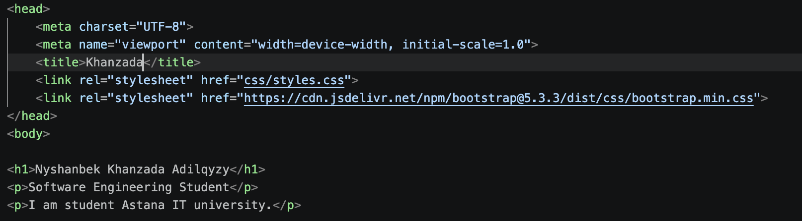
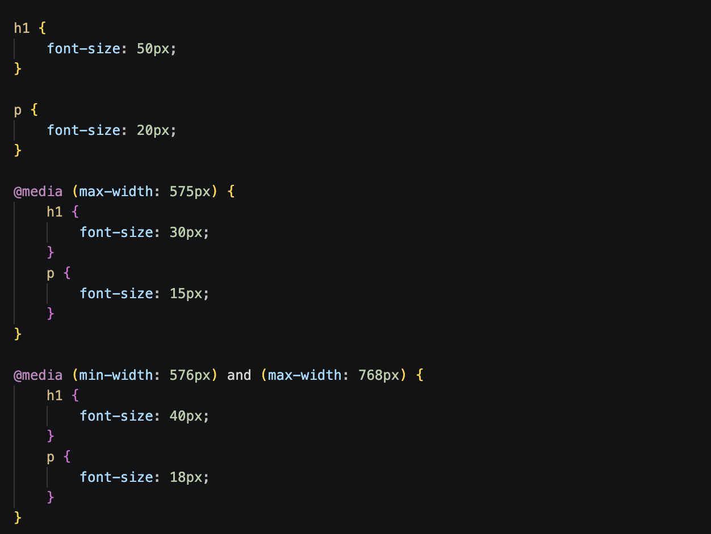
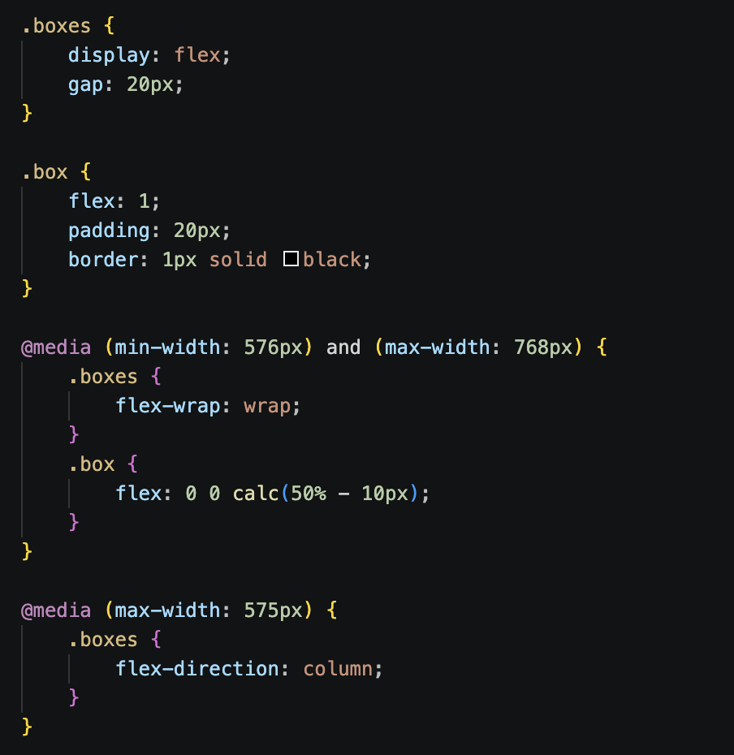
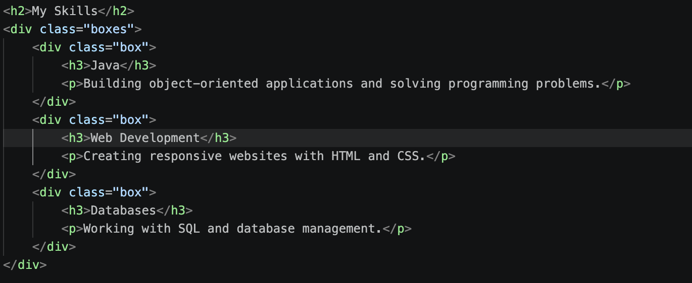
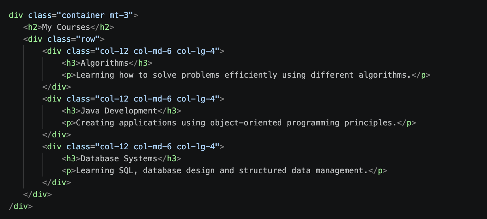
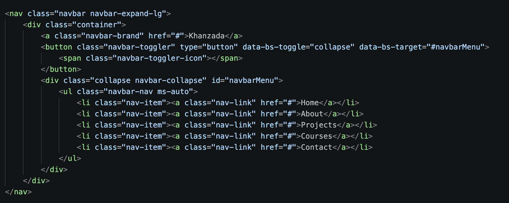
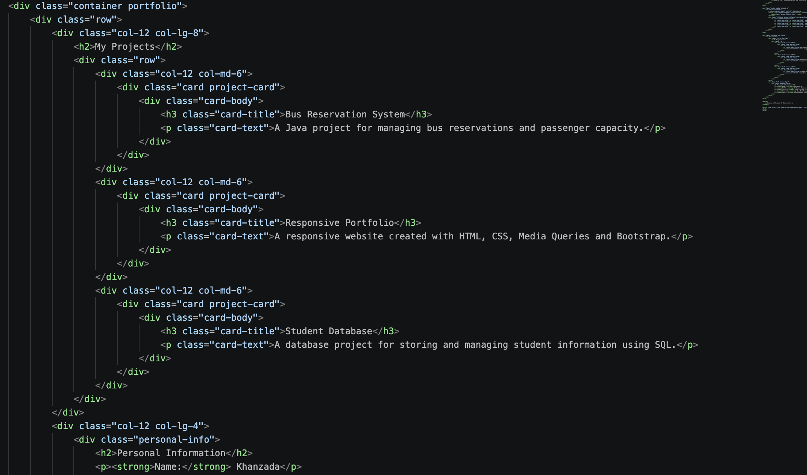
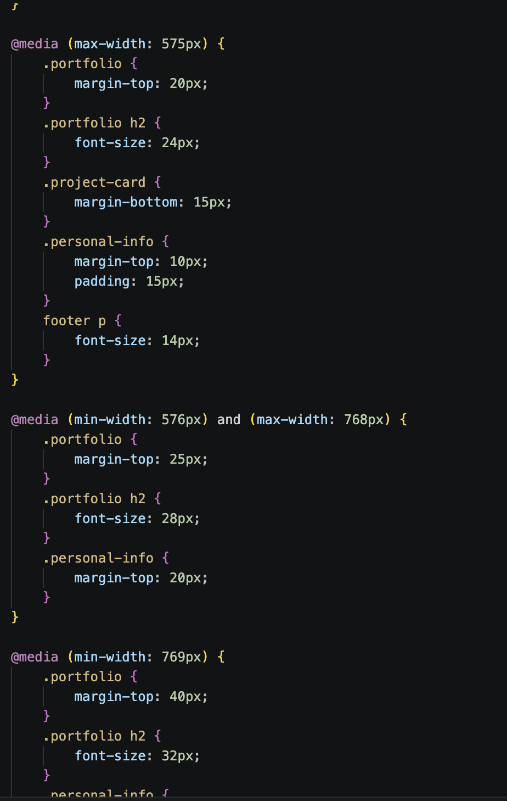

# Assignment 3 - Responsive Web Design

Name: Nyshanbek Khanzada Adilqyzy  
Group: SE-2539

## Task 0 - Responsive Typography

Created a simple webpage with headings and paragraphs.  
Used Media Queries to change font sizes for mobile, tablet and desktop screens.
 

## Task 1 - Responsive Layout with Media Queries

Created three boxes using CSS Flexbox.  
On desktop, the boxes are in one row.  
On tablet, two boxes are in the first row and one box is in the second row.  
On mobile, the boxes are displayed one under another.

 

## Task 2 - Bootstrap Responsive Columns

Used the Bootstrap 12-column grid.  
Created three columns that change their layout on mobile, tablet and desktop screens.

## Task 3 - Bootstrap Navigation Bar

Created a responsive Bootstrap navigation bar.  
The navigation links are shown on large screens and collapse into a hamburger menu on small screens.

## Task 4 - Responsive Portfolio Page

Created a responsive portfolio page using Media Queries and Bootstrap Grid.  
The page contains projects, personal information and a footer.  
The layout changes for different screen sizes.

## Conclusion

This assignment introduced new methods for responsive web design. I used CSS Media Queries with @media, max-width and min-width. They help change the page for mobile, tablet and desktop screens. I also used Flexbox methods such as display: flex, flex-direction and flex-wrap. They help arrange elements in different ways.
Bootstrap Grid was another new topic. I used the 12-column grid with container, row, col-12, col-md-6 and col-lg-4. These classes help create responsive columns.I also worked with the Bootstrap Navbar. I used navbar, navbar-expand-lg, navbar-brand, navbar-toggler, collapse, navbar-nav, nav-item and nav-link. The hamburger menu uses data-bs-toggle and data-bs-target. Bootstrap JavaScript makes the menu open and close.
Another new part was Bootstrap Cards. I used card, card-body, card-title and card-text to show project information.
Finally, I combined Media Queries, Flexbox and Bootstrap Grid to create a responsive portfolio page.